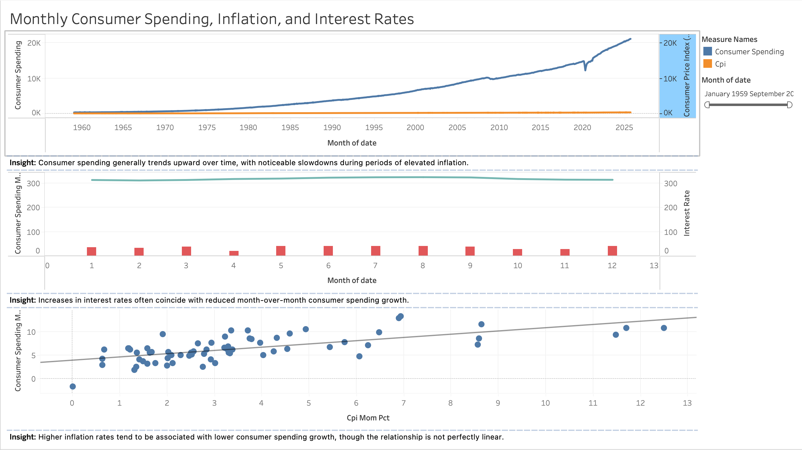

## Visualizations (Tableau)

The dashboard below explores the relationship between consumer spending, inflation, and interest rates using monthly U.S. economic data.

Key insights:
- Consumer spending tends to slow during periods of higher inflation
- Rising interest rates often coincide with reduced spending growth
- Inflation and spending growth show a generally negative relationship

[View interactive dashboard on Tableau Public](https://public.tableau.com/views/ConsumerSpendingInflationandInterestRatesMonthly/ConsumerSpendingInflationandInterestRates?:language=en-US&publish=yes&:sid=&:redirect=auth&:display_count=n&:origin=viz_share_link)
